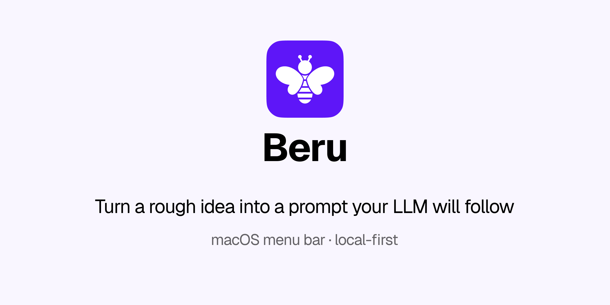

<p align="center">
  
</p>

# Beru

Select a rough idea, press a hotkey, and Beru turns it into a prompt your LLM will actually follow, aimed at Cursor, Claude, Codex, Gemini, ChatGPT, and the rest.


Beru lives in the menu bar. It does not take over the app you are writing in.

## How it works

1. Select the rough thought, notes, or half-written prompt, in Notes, Cursor, a browser, anywhere.
2. Press **⌃⌥⌘P** (you can change this).
3. **Enhance** rewrites it as a clear prompt, using that tool’s guides and Markdown conventions. **Replace** writes it back, or **Copy** takes it to the clipboard.

Too lazy to type? Press **⌃⌥⌘L**. Beru opens, listens on this Mac, and writes down what you say. Speak the rough idea; Enhance still turns it into a prompt. Press the shortcut again, or the mic, to stop. Audio is transcribed on-device and never leaves the machine.

Pick the target (Cursor, Claude, ChatGPT, …) so the prompt matches how that model wants to be asked. Add Codex, Gemini, or your own in Settings → Targets.

## Install

macOS 26+ only.

### Download (recommended)

1. Download **Beru-x.x.x.dmg** from [Releases](https://github.com/rahulsharmadesign/beru/releases).
2. Open the DMG and drag **Beru** into **Applications**.
3. macOS will block it (unsigned). Allow it once:

```bash
xattr -cr /Applications/Beru.app
```

4. Open Beru from Applications.

No Xcode, Homebrew, or Apple Developer account. Dependencies are inside the app.

No Terminal? Control-click Beru → **Open**.

**Optional:** if you use the **Ollama** provider, install [Ollama](https://ollama.com) separately and pull a model. Cloud providers (Groq, Anthropic, etc.) only need an API key in Settings.

### Build from source (developers)

```bash
xcode-select --install          # skip if Xcode tools are already installed
brew install xcodegen
git clone https://github.com/rahulsharmadesign/beru.git
cd beru
./scripts/make-signing-cert.sh  # once
./scripts/install.sh
```

That builds Beru, signs it on *your* Mac, installs it to `/Applications`, and launches it. The certificate script is one-time. After that, `./scripts/install.sh` is enough.

To publish a DMG, push a version tag (`v1.1.0`). GitHub Actions builds it. Locally: `./scripts/make-dmg.sh`.

## First run

1. Grant **Accessibility** when asked. Beru needs it to read and replace the selection. The welcome window closes on its own once the grant is there.
2. Open **Settings** from the menu bar and choose a provider.
3. Select some text and press the hotkey.

Optional: **Microphone** and **Speech Recognition**, only if you want voice dictation. Speech is recognized on this Mac.

## Providers

| Provider | Best for | What you need |
|---|---|---|
| **Ollama** | Everything stays on this Mac | [Ollama](https://ollama.com) and a pulled model |
| **Groq** | Fast and free to start | API key from [console.groq.com](https://console.groq.com) |
| **Anthropic** | Claude quality | API key from [console.anthropic.com](https://console.anthropic.com) |
| **Custom** | OpenAI, OpenRouter, LM Studio, anything `/v1` | Base URL, model id, key if the host wants one |

## What it can do

- **Enhance** — Turn a rough idea into a prompt for Cursor, Claude, Codex, Gemini, ChatGPT, and other LLM tools.
- **Grammar** — Fix spelling and grammar. Keep your meaning and tone.
- **Social replies** — Suggest a reply to a comment, mention, or DM.
- **Workplace voice** — Draft a reply as a manager, VP, or CEO. Save those voices as custom actions.
- **Summarize / Explain** — Compress the selection, or make it clear.
- **Custom actions** — Your own verb chips and prompts, in Settings → Actions.
- **Voice dictation** — Press **⌃⌥⌘L** (or the mic) and speak the rough idea instead of typing. Beru transcribes on this Mac; nothing is sent to Apple or a Beru server. Press again to stop.

## What’s next

- **Windows** is in progress. macOS is the supported build today.
- **Cloud storage** for settings and runs is on the list, so the same setup could follow you across machines. Local-only remains the default.

## Feature requests

Have an idea? [Open a feature request](https://github.com/rahulsharmadesign/beru/issues/new?template=feature.yml). Check [existing issues](https://github.com/rahulsharmadesign/beru/issues) first so we don’t double up.

## Privacy

Everything stays on this Mac.

- Settings, actions, targets, vault notes, and run history are stored locally. Nothing is uploaded to a Beru server, there isn’t one.
- No analytics, telemetry, or crash reporting.
- API keys live in the Keychain on this Mac.
- Selected text goes only to the LLM provider you configure.
- Run history is off until you turn it on, then it lives in `~/Library/Application Support/Beru/`.
- Beru is not sandboxed. Accessibility cannot work inside the App Sandbox.

Cloud sync for settings and runs is a later idea, not in this build.

Details: [SECURITY.md](SECURITY.md).

## Support

If Beru saves you time: [send a tip](https://razorpay.me/@rahulsharmadesign).

Bugs and ideas: [open an issue](https://github.com/rahulsharmadesign/beru/issues). Security problems: [private advisory](https://github.com/rahulsharmadesign/beru/security/advisories/new), not a public issue.

## Contributing

See [CONTRIBUTING.md](CONTRIBUTING.md). This project follows the [Code of Conduct](CODE_OF_CONDUCT.md).

```bash
brew install xcodegen
./scripts/make-signing-cert.sh
./scripts/install.sh
./scripts/qa.sh
```

## License

[MIT](LICENSE) © 2026 Rahul Sharma
